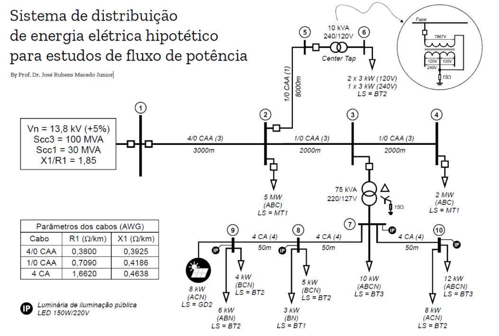

# Estudo de Caso: Regulador de Tensão em Sistemas de Distribuição

Este repositório contém todo o material, scripts e resultados obtidos durante a execução da **Situação Problema 2 (PBL2)** da disciplina de **Distribuição de Energia Elétrica (2026/1)** do curso de Engenharia Elétrica do IFES - Campus Guarapari.

O objetivo central do projeto foi analisar o impacto de dispositivos de regulação de tensão em um sistema de distribuição hipotético, avaliando diferentes topologias, estratégias de controle (LDC - *Line Drop Compensation*) e condições de operação (tensão nominal vs. tensão incrementada).

## Diagrama do Sistema
Abaixo, o esquema do sistema de distribuição hipotético utilizado nas simulações:



## Estrutura do Repositório

A organização dos arquivos no projeto segue a árvore abaixo:

```text
.
├── Objetivo_1/
├── Objetivo_2/
│   ├── Caso_1/
│   └── Caso_2/
├── Objetivo_3/
│   ├── Caso_1/
│   └── Caso_2/
├── Objetivo_4/
│   ├── Objetivo_1/
│   ├── Objetivo_2/
│   └── Objetivo_3/
├── DEE - PBL2 - 2026-1.pdf
└── Circuito REV1.pdf
```


Dentro de cada pasta ou subpasta de caso, você encontrará a seguinte organização:

Imagens/: Gráficos e perfis de tensão resultantes.

*.csv: Saídas brutas de simulação geradas pelo OpenDSS.

*.dss: Arquivos de modelagem do sistema e definições de carga.

*.py: Scripts de processamento de dados e geração de gráficos.
Requisitos e Execução
Ferramentas Utilizadas
OpenDSS: Para a realização dos fluxos de potência.

Python 3.x: Para automação, leitura dos arquivos .csv e plotagem técnica.

Configuração no Google Colab
Os scripts em Python (.py) foram desenvolvidos utilizando a arquitetura do Google Drive. Para executar estes códigos no ambiente Google Colab, siga estes passos:

Upload: Suba a estrutura de pastas deste repositório para o seu Google Drive.

Conexão: No início de cada script, monte o seu Drive no Colab:

from google.colab import drive
drive.mount('/content/drive')

Caminhos (Paths): Dentro de cada arquivo .py, existem variáveis de diretório (caminhos) que estão sem preenchimento. Você deve preencher esses campos com o caminho completo onde os arquivos estão armazenados no seu Drive (ex: /content/drive/MyDrive/Pasta_Do_Projeto/...).

Contexto do Projeto
O sistema em estudo simula um alimentador de 13,8 kV para avaliar a resposta de reguladores sob cenários de carga industrial. A análise foca na conformidade com o PRODIST (Módulo 8 da ANEEL), garantindo que os níveis de tensão permaneçam dentro dos limites normativos, mitigando desequilíbrios de fase e o deslocamento de neutro.

Desenvolvido para fins acadêmicos - Disciplina de Distribuição de Energia Elétrica, IFES Campus Guarapari.
